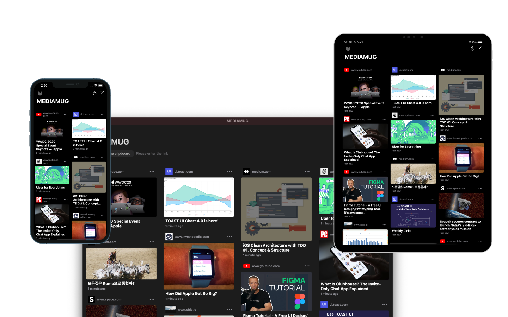

  

## [MEDIAMUG](itunes.apple.com/app/apple-store/id1553267032)

Collect the links you like. enjoy the content you need, anytime, anywhere, any device

Many people can't remember all the videos, socials, articles they watched. 
we will help you find it again later

## Requirements

- iOS 14.0+
- macOS 11.0+

## Contribution
Discussions and pull requests are welcomed 💖

## License
MEDIAMUG is under MIT license. See the [LICENSE](LICENSE) file for more info.